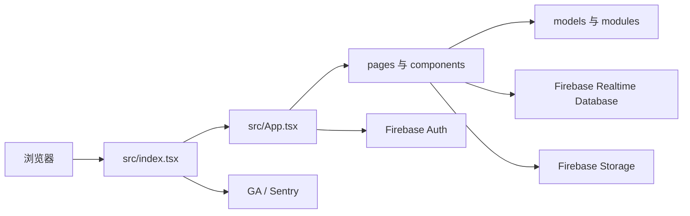

# Quorum（Muncoordinated）架构与组件说明

> 本文件是本仓库的维护入口。后续涉及代码、构建、测试或运行的工作，应先阅读本文件和 `AGENTS.md`，并以实际代码为准更新本文档。

## 1. 项目定位与技术栈

Muncoordinated 是一个用于 Model UN（模拟联合国）委员会管理的单页 Web 应用。它不包含自建 API 服务：浏览器中的 React 应用直接使用 Firebase 的身份认证、Realtime Database 和 Cloud Storage。

| 层级 | 实现 | 责任 |
| --- | --- | --- |
| UI | React 18、Semantic UI React、CSS | 页面、表单、响应式导航、计时器、提示与中英文界面 |
| 路由 | React Router v5 + `history` | 客户端路由及页面切换 |
| 状态/实时同步 | Firebase Realtime Database（兼容 API 为主） | 委员会及其所有业务数据的实时读取和写入 |
| 身份认证 | Firebase Authentication | 邮箱注册、登录、登出、重置密码及写入权限身份 |
| 文件 | Firebase Cloud Storage | 委员会附件上传、下载、删除 |
| 可观测性 | Google Analytics、Sentry | 页面访问与客户端错误/性能上报（仅非本地模拟器模式） |
| 构建/测试 | Vite、TypeScript、Vitest、Cypress、Firebase CLI | 开发服务器、生产构建、单元和端到端测试 |

## 2. 运行时总体结构



`src/index.tsx` 初始化 Google Analytics、Sentry、浏览器 history 与 Semantic UI 样式，并把 `App` 挂载到 `#root`。`src/App.tsx` 初始化 Firebase；若 `VITE_USE_FIREBASE_EMULATORS=true`，则连接本机 Auth（9099）、Realtime Database（9000）和 Storage（9199），否则连接 `muncoordinated` Firebase 项目。

`src/i18n.tsx` 提供无外部运行时依赖的界面国际化层。当前支持英语和简体中文；英语原文同时作为稳定词条键，简体中文词条集中维护。`LanguageProvider` 在语言变更时重新挂载界面，使类组件与函数组件统一获取新文案，并集中覆盖 Semantic UI 的搜索空结果、可新增选项等默认文案；语言切换控件嵌入主页、创建页和委员会工作区的导航菜单。用户选择保存在浏览器 `localStorage` 的 `muncoordinated-language` 项中，首次访问则根据浏览器语言选择默认值。除用户模板名称外，业务数据（委员会名称、帖子正文等）不会被翻译或写回；用户模板可保存多语言名称，并在模板管理和创建委员会时按当前界面语言解析。预设国家和地区名称仅在显示时按当前语言本地化，Firebase 中的规范值保持不变。

简体中文排版由 `src/App.css` 中基于 `html[lang='zh-CN']` 的全局规则控制：统一中文字体回退、菜单/按钮/表头和术语列的防拆分规则，并通过 CSS 容器查询按栏宽调整表格密度；支持 `word-break: auto-phrase` 的浏览器会自动使用词组感知换行。新增页面通常无需为中文逐项添加排版补丁。

## 3. 路由与页面职责

| 路径 | 页面/组件 | 主要职责 |
| --- | --- | --- |
| `/` | `Homepage` | 产品主页与入口 |
| `/onboard`、`/committees` | `Onboard` | 登录后创建委员会 |
| `/templates` | `Templates` | 管理当前登录账号的自定义委员会模板及模板成员 |
| `/committees/:committeeID` | `Committee` | 订阅整个委员会数据、显示欢迎页及主导航 |
| `.../setup` | `Admin` | 委员会基础资料与成员设置 |
| `.../motions` | `Motions` | 动议队列、表决及相关计时流程 |
| `.../unmod` | `Unmod` | 自由磋商计时器 |
| `.../caucuses/:caucusID` | `Caucus` | 有主持核心磋商、发言队列、发言记录与计时 |
| `.../resolutions/:resolutionID/:tab?` | `Resolution` | 决议文本、修正案、讨论流与投票 |
| `.../strawpolls/:strawpollID` | `Strawpoll` | 意向性投票选项与计票 |
| `.../notes` | `Notes` | 委员会笔记 |
| `.../posts` | `Files` | 链接、文本和 Storage 附件 |
| `.../stats` | `Stats` | 委员会统计 |
| `.../settings`、`.../help` | `Settings`、`Help` | 行为设置和使用帮助 |

`Committee` 是委员会工作区的壳层：它对 `/committees/:committeeID` 建立 Realtime Database `value` 订阅，把当前委员会对象交给导航和管理页；具体业务页通常各自建立对应订阅。

## 4. 数据模型与数据流

Realtime Database 的主根节点是：

```text
committees/{committeeID}
  creatorUid, name, chair, topic, conference, template
  members/{memberID}
  caucuses/{caucusID}
  resolutions/{resolutionID}
  strawpolls/{strawpollID}
  motions/{motionID}
  files/{postID}
  timer, notes, settings

templates/{creatorUid}/{templateID}
  name
  defaultLanguage
  names/{languageCode}
  members/{memberID}
    name, rank, present, voting
```

`src/models/committee.ts` 定义 `CommitteeData`、默认委员会和内置模板。`src/models/template.ts` 定义账号级自定义模板及其 Firebase 增删改辅助函数；模板成员复用委员会成员的四种 `Rank`、出席和必须投票字段。其余 `src/models/*.ts` 文件定义对应子资源（成员、动议、磋商、决议、调查、帖子、计时器和设置）及创建/更新辅助函数。页面通过 Firebase 引用的 `on('value')` 接收实时快照；`src/modules/handlers.ts` 将输入控件事件映射为字段级 Database 写入。计时相关更新使用 Realtime Database transaction，以减少并发更新冲突。

浏览器本地还会通过 `src/hooks.ts` 的 `useLocalStorage` 保存匿名投票者 ID；这使公开投票/队列功能可以识别同一浏览器而无需一定登录。

## 5. 身份、权限与文件

- `src/components/auth.tsx` 使用 Firebase 邮箱密码认证，并查询 `creatorUid` 等于当前用户 UID 的委员会以显示“我的委员会”。
- `database.rules.json` 允许读取委员会；常规写入要求登录用户是该委员会创建者。对公开队列、公开修正案、公开调查选项/投票和公开动议存在细粒度例外。
- `templates/{creatorUid}` 仅允许 UID 对应的登录用户读写，自定义模板不会向其他账号或未登录访问者公开。
- `storage.rules` 允许公开读取 `committees/{committeeId}/{fileName}`；上传需写入委员会创建者 UID 元数据。文件拥有者或委员会主任可更新/删除。
- `Files.tsx` 同时维护 Database 中的文件/帖子元数据和 Storage 中的二进制对象。

因此，数据库规则和 Storage 元数据是产品的关键安全边界；变更前必须同时审查前端写入路径与这两份规则文件。

## 6. 工程目录与部署

| 位置 | 内容 |
| --- | --- |
| `src/pages/` | 路由级业务页面 |
| `src/components/` | 可复用 UI、认证、计时器、通知、连接状态 |
| `src/models/` | 数据类型、默认值和 Firebase 数据操作 |
| `src/modules/` | 通用事件处理、成员转换、统计和埋点 |
| `src/i18n.tsx` | 英语/简体中文词条、语言偏好与全局语言切换控件 |
| `cypress/` | 端到端用例、模拟器种子和支持代码 |
| `scripts/` | Firebase Emulator 与 Cypress 编排、规则部署 |
| `database.rules.json`、`storage.rules` | Firebase 权限规则 |
| `firebase.json` | 本地模拟器端口与 Firebase Hosting 配置 |
| `netlify.toml` | Netlify 构建命令（`pnpm build`）与 `build/` 发布目录 |

生产构建输出为 `build/`。`firebase.json` 同时定义 SPA 回退重写；当前 `netlify.toml` 指定 Netlify 使用 Node 22。

## 7. 本地开发、验证与限制

先安装依赖：

```sh
pnpm install --frozen-lockfile
```

本仓库的 WSL 本地工具链位于被忽略的 `.tools/`。先执行下面命令，便可使用该目录中的 Node 22、pnpm 10 与 Java 21；它还会把错误继承的 Windows 临时目录改为 `/tmp`：

```sh
source scripts/wsl-env.sh
```

常用命令：

```sh
pnpm start                         # Vite 开发服务器（localhost:5173）
pnpm exec vitest run               # 一次性单元测试；pnpm test 是 watch 模式
pnpm build                         # TypeScript 检查并生产构建
pnpm emulators                     # Firebase Auth/RTDB/Storage 模拟器
VITE_USE_FIREBASE_EMULATORS=true pnpm start
pnpm test:e2e                      # 模拟器 + Vite + Cypress 集成测试
```

Firebase Emulator Suite 需要 Java 21 或更高版本。端到端测试只能连接本地模拟器，不能指向生产 Firebase 项目。Cypress 二进制若未预下载，可能因网络限制无法下载；此时至少运行 TypeScript 构建和 Vitest，并如实记录 E2E 未执行原因。

## 8. 维护注意事项

1. 这是 React Router v5、Firebase compat API 与少量 Firebase modular API 并存的代码库；修改 Firebase 初始化或引用类型时要兼容两种用法。
2. 生产默认会连接真实 Firebase。任何本地手工测试应显式设置 `VITE_USE_FIREBASE_EMULATORS=true`。
3. 不要把 Firebase 配置中公开的 Web 配置误判为服务端密钥；真正的访问控制由 Firebase Rules 和用户身份决定。
4. 新增委员会字段或公开协作功能时，同步更新 TypeScript 模型、默认值、前端写入路径、规则和测试。
