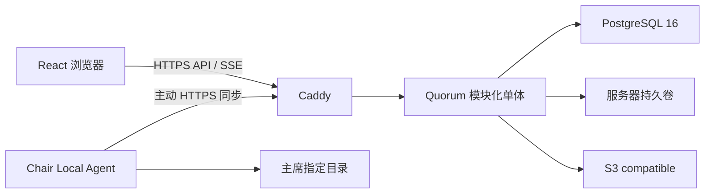

# Quorum 架构与组件说明

> 本文件是本仓库的维护入口。涉及代码、构建、测试、运行依赖、安全边界或部署模型的工作，应先阅读本文件和 `AGENTS.md`，并以实际代码为准同步更新。

Quorum 已完成自主托管实施计划阶段 0–9。当前只有一条生产运行路径：React 浏览器通过同源 HTTP API 与 SSE 访问 Node.js 模块化单体，PostgreSQL 16 保存账号、权限、议事、文件元数据、事件和审计。文件字节由服务器持久卷、S3 compatible provider 或当前 Chair Local Agent 承载。旧 BaaS 运行代码、Functions、Rules、emulator、SDK、CLI 和对应浏览器测试资产已删除；当前仓库不提供旧数据导入或双写。

## 1. 技术栈与拓扑

| 层级 | 实现 | 责任 |
| --- | --- | --- |
| 浏览器 | React 18、TypeScript、React Router v5、Semantic UI React | 身份、委员会、模板、议事、文件和运维页面 |
| 同源边界 | Caddy | HTTPS、SPA fallback、API/SSE 反向代理、安全响应头 |
| 应用 | Node.js 22 TypeScript 模块化单体 | 身份、授权、业务命令、文件编排、worker、健康与指标 |
| 业务真相 | PostgreSQL 16 | 状态、revision、幂等结果、事件、审计、任务与文件元数据 |
| 文件 provider | SERVER_VOLUME、S3_COMPATIBLE、CHAIR_AGENT | 经大小/SHA-256 校验的不可变内容字节 |
| 可观测性 | 结构化 stdout、Prometheus `/metrics`、Sentry、Google Analytics | 服务运行证据、聚合指标和浏览器错误/访问上报 |
| 构建与测试 | pnpm、Vite、Vitest、PostgreSQL integration、Docker Compose | 类型检查、生产构建、契约/服务/HTTP/数据库验证 |

搜索词使用服务器本地 `pinyin-pro` 生成中文拼音首字母；生成词与账号维护的国家检索词分别存放在 PostgreSQL。浏览器只匹配服务器返回的候选项搜索词，不请求外部拼音服务。



生产 Compose 只暴露 Caddy 的 80/443；PostgreSQL 没有主机端口映射。应用和数据库使用持久卷，浏览器不直接连接数据库、对象存储或 Chair Agent。

## 2. 浏览器应用

`src/index.tsx` 初始化浏览器 history、语言、主题、Semantic UI、Sentry 与 Google Analytics，再挂载 `src/App.tsx`。`App` 无运行模式分支，始终进入 `SelfHostedIdentity`。浏览器身份使用 Secure、HttpOnly、SameSite=Lax Session Cookie；客户端只通过 `src/services/self-hosted-identity.ts` 和 `self-hosted-api.ts` 请求同源 `/api/v1`。

`SelfHostedIdentity` 覆盖首次管理员初始化、登录、基于已认证 Session 的临时密码强制修改、匿名公开委员会入口、退出和系统管理员账号管理。`SelfHostedWorkspace` 使用基于 URL 的响应式会议导航：桌面端按实际菜单宽度依次隐藏实时状态文字、合并设置与帮助、折叠统计、文件、笔记和意向性投票；折叠项集中在更多菜单，意向性投票保留按可用空间向左或向右展开的子菜单。剩余入口仍放不下时沿用迁移前的 `Pushable/Pusher`、内容遮罩点击关闭和 `uncover` 侧栏；模板、系统运维、语言、主题和退出入口集中在账户菜单。它提供：

- `/committees`：公开/私有委员会列表与创建；
- `/countries`、`/templates`：沿用迁移前的表格编辑交互管理账号级国家模板和委员会模板；国家模板先按名称创建空模板再编辑国家，内置国家模板可查看和克隆，委员会创建器提供内置委员会模板；
- `/committees/:id`：默认跳转点名页；委员会名称入口打开居中的卡片化委员会信息页。会场设置、动议、自由磋商、发言名单、决议草案、意向性投票、问题、笔记、资料、统计、设置和帮助保持各自路由；动态发言名单、决议草案与意向性投票使用资源 ID 子路由，资料页按权限提供文件总览、文件审核、分享、上传文件、存储设置和文件设置；菜单与存储位置无关，分享仍仅限主席代办模式；
- `/delegate-files`：能力链接进入的免登录代表文件入口；浏览器以 HttpOnly 凭据绑定一次代表团选择，并使用独立 CSRF cookie、文件 API 与 SSE，不获得委员会普通成员权限；
- `/system-settings`：仅系统管理员使用，按子路由分为运行状态（`operations`）、委员会默认设置（`defaults`）、界面设置（`interface`）、缓存设置（`cache`）和存储配置（`storage`）；运行状态用卡片展示容量、队列、retention 与缓存信息，文件清单可折叠。缓存额度表单独立于状态页，委员会默认行为和默认驳回类型独立于账号管理。旧 `/operations`、`/storage` 地址跳转到对应子页；
- `/admin`：账号创建、重置、禁用、Session 撤销和不可逆匿名化。

委员会工作区 Context 统一持有受众过滤快照、活动规则只读模型、SSE 游标、连接状态、刷新和命令执行器；各路由子页不重复建立监听。一个委员会保持最多一条 SSE。决议直接表决在请求及快照刷新期间锁定投票、撤销和席位切换，服务器确认成功后才更新当前席位及本地撤销记录。文件区按主席或所有者权限并行预取审核列表与分享状态，数据保留在文件区父组件的内存中；切换子页保留已加载内容并后台刷新，委员会事件也刷新两项数据。首次加载与空结果、错误分开显示；离开文件区或切换委员会、账号、权限及运作模式时释放数据，不写浏览器持久存储。客户端检测事件序号缺口、未知事件或过期游标时丢弃增量并重新取完整快照，不从本地猜测权威状态。陈旧 revision 会刷新快照并要求用户确认最新状态后重试；幂等冲突和规则冲突均要求显式刷新或裁决，不静默覆盖。`OFFLINE_READONLY` 状态在整个委员会工作区撤销写控件。活动规则只读模型由现有 `rule_package_versions.definition` 派生，不增加数据库表或 migration。

点名页使用每页 9 席的三列三行矩阵，按列从上到下排列。当前内置规则只提供“出席”和“缺席”；点名只记录出席状态。使用委员会模板时，模板给出席位的初始表决权；席位设置页负责之后的调整和手动新增席位的设置。点名页显示服务端返回的冻结席位名单；席位新增、重新启用或属性变动后，进行中或已完成的当前会期点名自动按现役席位重开，旧点名与回答保留为历史。Chair 可直接选择冻结名单中的任意席位并改答；浏览器仍只提交 `baseRevision`、目标席位和冻结回答，服务端在事务内追加新的 entry、撤销被替代 entry，并生成事件、审计及完成后的出席事件。原有顺序录入、撤销和重置命令继续保留。

会期按委员会创建顺序命名为“第X会期”。新会议启动事务会创建唯一、关闭的主发言名单及发言计时器；“暂停会议”动议通过会原子关闭当前会期并预建下一待开始会期，续会在同一事务中重新关联前一会期的同一名单，保留队列、计时器和发言历史。若名单缺失，首次启动返回可恢复冲突；主席确认后的重试可按待开始会期规则包创建唯一替代名单。会期内部的正式辩论状态只由已通过的开启/关闭正式辩论动议更新，并决定替代名单开关；主席手动开关名单不改变它。migration 38 也会为升级时开放且尚无主发言名单的会议补建同一资源、公开事件和系统迁移审计，发言时间优先取活动规则包并以 60 秒兜底。普通有主持核心磋商仍由主席通过必填主题表单或已通过动议创建。旧版的队列顺序和双计时器分列设置保存在委员会行中，经 revision 命令、事件和审计更新，并随工作区快照下发。工作区快照同时提供会期清单与跨会期问题、动议历史，前端按会期名称分隔但仍按时间倒序展示。主席可按 revision 撤回待处理问题；撤回记录保留为 `WITHDRAWN`，追加事件和审计，不再进入工作区快照。笔记保留多笔记选择器，浏览器停止输入约 600ms 后调用原有版本化笔记命令，服务端仍保存每次已提交修改的历史边界。

决议草案与修正案沿用迁移前的即时加号和卡片编辑交互，正文均支持文本或单个已发布文件。决议草案的起草国与附议国保存为 `resolution_countries` 多国名单，快照附带国家名称和旗帜并按点名顺序排列；migration 67 迁移原单国字段。展示草案动议保留已编辑的国家名单，关联磋商初始发言队列为空，由主席添加国家。修正案仍保留单个提案国。文书页只选择本委员会 `PUBLISHED` 文件，上传与审核保留在文件模块；下载先准备、查询状态再下载。新版本绑定在委员会锁、文书锁与文件锁内校验权限、revision、冻结状态及发布状态，文件批准、驳回、发布和删除按委员会到文件的顺序锁定。引用仍读取文件记录的当前版本，两个工作区快照保留未发布和已删除引用的真实状态及文件类型；切换显示模式不清空正文。修正案先作为系统顺序命名的草稿创建，只有通过“展示修正案”动议才能公开；动议引用既有修正案，不重复创建资源。未产生正式表决、未进入结果状态的修正案可逻辑删除，正文和版本继续保留并追加审计；一旦产生表决或记录结果，服务端拒绝删除。主席在旧版状态下拉中记录纳入或未采纳，结果更正继续追加历史。“对修正案投票”动议通过后冻结当前版本并进入 `VOTING`，卡片内创建和显示保留的新式正式 ballot；此后人工状态下拉锁定，发布 ballot 结果原子写入纳入或未采纳状态。

意向性投票准备阶段的题目、选项与配置保留在当前编辑表单中，点击创建时统一提交新一轮并启动投票；不再在字段失焦时创建新轮次。提交期间禁用编辑和重复创建，沿用原有轮次、revision、事件与审计边界。

`src/i18n.tsx` 提供英语与简体中文界面，使用大陆模拟联合国术语。语言选择继续保存在兼容键 `muncoordinated-language`。界面语言通过 `useLanguage` 订阅刷新，`LanguageProvider` 不再以语言作为 key 重建整棵子树；应用入口和主题入口保持组件身份，模板编辑草稿保存其开始编辑时的语言。`packages/contracts/src/localization.ts` 与规则 schema 中的语言检查提供显式内容名称和缺失翻译定位的基础；委员会数据库保存不可变语言、目录与成员副本，自动名称读取显式编号和自定义标题，进度见 `docs/self-hosted/LOCALIZATION_IMPLEMENTATION.md`。`/system-settings/interface` 提供管理员专用“启用主题功能（实验性）”开关，保存在 `system_settings`，默认关闭；匿名只读 `/api/v1/theme-settings` 供所有页面读取，管理员写入沿用身份、CSRF、revision 与审计校验。前端启动及路由切换读取开关，未加载或读取失败时使用默认主题并隐藏主题入口；确认关闭时重置浏览器选中主题但保留导入主题。保存后当前页面立即更新，其他页面刷新或切换路由生效。`src/theme/` 的 Theme API 2 只接受白名单声明式设置；旧 API 1 主题和既有 localStorage 键继续作为显式兼容边界。主题不能隐藏、重排或改写业务控件和数据。

“休会”动议通过时与“暂停会议”共用结束当前会期、预建下一待开始会期的事务，并额外保存委员会的 `meeting_ended_at`。此标记表示整场会议已结束，不改变委员会生命周期状态、权限或后续操作；点名页仍允许直接开始下一会期，成功开始时在同一事务内清除标记。结束与重新开始的事件和审计保存标记变化，原休会动议及会期历史继续保留。动议空态、点名页和委员会信息显示“会议已结束”。旧的已通过动议不追溯执行。

工作区快照的 `attendance` 继续表示当前会期，`attendanceBySession` 提供按会期保存的出席状态。历史动议的提出者与附议者按所属会期显示缺席标记；关闭会期保留的最终出席状态不会被新会期点名覆盖，复用现有 `current_attendance` 数据，无需新增存储。

## 3. 服务端模块与数据边界

`server/` 是单进程模块化单体。启动时使用 PostgreSQL advisory lock 执行带 SHA-256 校验和的顺序 migration；源码 schema compatibility 为 68。实例级 `system_settings` 保存新委员会的默认运作模式与创建者是否自动获得 Chair；它们只在创建事务中读取，不追溯既有委员会。系统管理员不能创建委员会。数据库版本、连接、存储目录可写性或容量采样不满足要求时 readiness 失败。

| 模块 | 责任 |
| --- | --- |
| Identity | bootstrap、Argon2id 密码、Session、账号生命周期和身份审计 |
| Stage 3/4 | 委员会、席位、模板、规则包、点名、问题和文本资源 |
| Stage 5 | SSE、权威计时器、发言/让渡、动议、ballot、Strawpoll、决议与修正案 |
| Storage | durable staging、provider、文件版本、审核发布、下载、删除和迁移 |
| Storage Agent | 配对、lease fencing、manifest/task、内容传输、本地变化与冲突 |
| Delegate Files | 主席控制的能力链接、代表团浏览器绑定、代表上传/审核、已发布文件与独立 SSE |
| Operations | 归档导出、委员会删除、账号处置、retention、状态、健康和指标 |

`packages/contracts/` 保存浏览器、后端与 Agent 共用的错误码、事件、审计动作、响应类型和不可变规则快照。`packages/rule-schema/` 保存规则包 v1 的 schema、安全表达式求值和唯一启用的内置规则「北京学术标准 2021」fixture（北京规则第 6 版；旧 `Quorum Default` fixture 仅保留用于规则 schema 测试）。`packages/storage-agent/` 保存独立 Chair Agent 客户端、安全目录、扫描、恢复循环和发布入口。

委员会创建必须显式选择内容语言（`zh-CN` 或 `en`）、已发布规则版本及模板 revision。Stage 3 创建入口委托 Stage 4 的同一事务，锁定源模板并检查完整目录、成员和规则的实际翻译，原子保存 `committees.content_snapshot`。语言和固定副本由 migration 56 的触发器禁止修改；席位只能引用副本中的稳定标识，名称与旗帜不可改，权限和排序仍可调整。公开/代表快照不包含私有目录。规则激活及 FUTURE 调整也校验内容语言；正常升级保留已发布旧版本，内置 v6 沿用原名称并移除“出席并参与表决”回答。

migration 57 将会期的持久名称替换为不可变 `ordinal`，委员会保存单调递增的 `next_session_ordinal`。触发器在插入时分配序号，删除不回收、修改时间戳不改号；工作区名称由序号与委员会语言格式化。直接开会请求使用持久幂等，暂停/休会预先创建的待开会期恢复时不重新分配。归档和文件建议读取固定会期序号；migration 58–60 同时给决议（会期内）、修正案（委员会内）与意向性投票（会期内）分配不可变编号，文档和发言名单用 `custom_title` 的空值明确区分自动名称与用户原文。文件建议返回类型与数字；历史动议、问题和发言名单选项读取资源关联的规则定义。归档导出所有引用版本，包括尚未激活的规则调整。

这次不兼容变更把 API contract 升为 3、工作区快照升为 3、归档格式升为 2；归档包含完整固定副本与席位旗帜。migration 56 对含旧委员会的数据库明确拒绝升级，不推断旧名称。完整多语言、自动名称编号及受控重建流程仍在实施，详见 `docs/self-hosted/LOCALIZATION_IMPLEMENTATION.md`。

所有业务写入使用表达意图的命令。服务端从 Session 或独立 Agent 凭据推导 actor，在一个 PostgreSQL 事务中完成授权、行锁/revision 检查、状态变化、事件、审计和 durable 幂等结果。系统管理员、Committee Owner、Chair 与代表席位是独立能力；系统管理员不能创建委员会或获得 Chair 学术权限，普通创建者是否自动获得 Chair 由实例级默认设置决定。

公开委员会只向匿名读者返回公开字段和已发布文件。私有委员会对未授权身份统一隐藏。正式 ballot 冻结席位资格、must-vote、门槛、否决席位和规则版本；一席一票由数据库唯一约束保证，更正票追加历史。匿名意向性投票分离回执与选项，不保存投票人与选项关联。

席位类别只有 `STANDARD`、`NGO`、`OBSERVER`，表决权、否决权、不得弃权独立保存，后两项要求表决权开启；接口和数据库同时校验。migration 54 将当前席位和模板成员的旧 `VETO` 类别转为 `STANDARD` 并保留否决权，不改写审计或正式表决快照。设置页与模板页开启否决权会开启表决权，关闭表决权清除否决权和不得弃权，切换类别不修改能力。正式表决选择器、弃权操作和结果展示读取该场快照；决议草案直接投票继续读取当前席位配置，通过现有委员会事件刷新。动议直接投票保留包含无表决权席位选项，意向性与匿名投票不引入否决效果。程序性正式表决现有的否决计算保留，未统一到动议直接投票规则。

## 4. 实时、并发与审计

PostgreSQL 委员会事件表提供严格递增序号，SSE 只是传输通道。一个命令提交后，快照、事件和审计来自同一业务事务。数据库通知只唤醒进程，不承载唯一事件副本。

- 普通资源使用整数 revision 和 `409 Conflict`；
- 可重试创建与破坏性命令使用 `Idempotency-Key`；
- 计时器保存服务器时间基准，不每秒写数据库；
- 发言队列通过行锁和唯一活动位置串行化；
- Chairman override 显式记录原版本、操作者与原因；
- 业务审计和委员会事件追加写，只有受 fenced 委员会永久删除事务才能清除所属历史。

## 5. 文件与 Chair Agent

PostgreSQL 是文件 entry、不可变 version、大小、SHA-256、provider binding、同步状态和删除墓碑的唯一业务真相。浏览器上传直接流入 durable staging，不先读取完整文件到内存；用户文件名不参与内部磁盘或对象 key。完整字节经服务器重算大小与 SHA-256 后才能提交版本。

SERVER_VOLUME 使用 0600 临时文件、fsync 和无覆盖原子发布。S3 endpoint 只接受经过 SSRF 校验的 HTTPS 目标，凭据使用实例 master key 与带版本 AAD 的 AES-256-GCM 密文；响应、事件和日志不回显凭据。下载在发送 200 前重新验证 provider 字节，并始终使用安全 attachment、nosniff 与同源隔离头；危险可执行类型强制为 `application/octet-stream`。

逻辑删除立即隐藏文件并写不可恢复墓碑，再由 durable job 幂等清理每个物理副本。provider migration 复制全部历史 blob 并复验后才原子切换 binding；失败时旧 provider 继续服务。maintenance worker 只清理明确终态且可删除的 staging，唯一暂存副本、待重试 copy 和退休源副本不因期限、LRU 或容量压力删除。

Chair Agent 使用独立 `QuorumAgent` authorization scheme。一次性配对码和设备凭据只保存哈希；一个委员会最多一个活动 host。单调 lease generation fence 使转移或撤销后的旧设备不能 heartbeat、claim、上传或完成任务。Agent 对本地路径做规范化并拒绝链接、硬链接、非普通文件和目录逃逸；服务端下发内容先完整校验再原子替换。本地并发编辑、墓碑冲突和主机转移不会静默覆盖，均形成 durable 冲突供 Chair 显式裁决。Agent 以独立 heartbeat 维持 lease，以不含任务内容的 SSE `wake` 近实时触发同一个单飞同步循环，并保留 30 秒 durable reconciliation；SSE 断线不改变 PostgreSQL task 的权威性。

存储位置只决定文件字节保存在哪里，不决定菜单、审核或分享能力。SERVER_VOLUME、S3_COMPATIBLE、CHAIR_AGENT 都通过 `Stage6StorageService.recordProviderCommitInTransaction` 在持久保存与校验成功后原子创建待审核文件和提交来源；主席上传来源为 CHAIR，代表上传沿用分享发起主席作为技术保管人，另存代表团、类型和提交时间。上传及代表来源在同一幂等事务创建，文件类型改变后的重试返回冲突。保存失败或未完成的主机任务不创建可批准的文件；网页显示正在保存或保存故障。尚未正式发布的文件追加内容后重新待审核并清除旧审核结果；正式文件只能通过独立提交的批准替换，原发布版本在审核期间继续可用。缺失来源继续显示未知。

代表文件分享在主席代办、活动或暂停委员会、已配置活动存储且有开放会期时可启动。能力链接放在 URL fragment 中；代表选择当前开放会期中出席或暂离的席位后，取得 30 天 HttpOnly 浏览器凭据。结束分享、运作模式切换或归档/删除委员会会撤销凭据；schema 64 将存储切换、迁移或临时不可用与分享失效分开。凭据只允许本委员会已发布文件、本人代表团提交历史及上传，不获得普通成员权限。schema 65 保留服务器卷/S3 保存失败标记；验证过的暂存内容仍可重试，刷新代表页面后仍显示失败。服务器卷和 S3 不以主席电脑在线状态判断可用性；主席电脑离线时缓存命中的已发布文件仍可下载。

文件总览合并审核操作，按权限显示文件状态、来源、类型和提交时间；主席可在同页审核待处理文件。筛选提供“待审核与已发布”和“已驳回”；待审核按提交时间升序，已审核按审核时间降序，两组以分隔线区分。原审核页地址重定向至总览。批准时主席确认展示名和类型，发布、事件与审计同事务完成；发布沿用委员会现有访问权限，私有委员会不因此开放匿名访问。驳回保存独立状态、理由与审核时间，通知仅向提交代表团发送；文件默认保留，确认删除后沿用逻辑删除与物理清理，审核记录保留。文件名建议按提交会期和同类型已批准文件数生成；上传大小上限由 bootstrap 返回部署运行值。

schema 66 以 `formal_name` 保存正式名称：使用与 JavaScript `trim()` 相同的首尾空白规则，区分大小写，不做模糊匹配或 Unicode 归一化。委员会内未删除正式文件有数据库唯一约束，待审核名称不占用；删除后的名称可供新记录复用，旧引用仍不可用。迁移先列出既有重名文件和文书引用，发现冲突即回滚，不自动合并。

批准预览返回绑定源提交 revision/版本/摘要、名称、类型、目标 ID/revision/版本的确认值。同名批准需要居中二次确认，服务端按委员会、源文件、目标文件顺序锁定并重验，在同一事务追加目标版本、发布、保留源提交审核结果、写事件及审计。目标 ID 不变，新版本复用源 blob，不复制字节；`source_file_entry_id` 与 `merged_into_file_entry_id` 保留来源关系。已合并提交不再作为候选或第二条正式文件出现；代表历史仍按原提交席位授权。Stage 4/5 快照及下载可解析既有源引用至正式目标。正式文件删除连同合并来源的全部字节按原清理流程处理，没有文书引用删除保护。

Chair Agent 网页上传使用 `submissions/<entry ID>/content` 独立路径，原文件名仅作业务元数据，既有路径保留。替换发布沿用正式目标路径，缓存回填追踪源提交的持久副本。已发布文件的本地改名或内容更新生成 `REVIEW_REQUIRED` 冲突，只允许保留服务器版本，并引导网页上传审核；同步与删除能力保留。

委员会文件设置保存在委员会行的 `delegate_file_settings` 中，使用独立 revision 和审计保存。管理员在 `system_settings` 管理新委员会的默认驳回类型；两个委员会创建入口均在创建事务内复制默认值，既有委员会独立保存。主席资料页的“文件设置”管理驳回类型、固定代表提示或自行输入方式，以及三种文件类型的后缀白名单。代表 bootstrap 返回许可后缀和已绑定席位国旗；上传创建前服务端校验最后一个后缀（不区分大小写），不合规则不创建上传或审核记录。驳回命令按委员会当前选项解析消息并保存当时文本，历史记录不随选项修改。后缀限制不等同于文件内容检测。

CHAIR_AGENT 字节的权威持久副本仍在主席电脑。服务器使用同一持久卷中的独立 cache 命名空间保存非权威副本，并用 `REVIEW_PINNED` / `READY` / `MISSING` / `FETCHING` / `EVICTING` / `FAILED` 记录状态。管理员配置保存在 PostgreSQL，生效容量上限取数据库值与部署硬边界的较小值，最低剩余空间取较大值。待审核副本不参与 LRU，所有主席电脑上传（含主席上传）均受审核缓存额度约束；批准或驳回后解除固定保留。服务器卷与 S3 的权威副本不占用主席电脑审核缓存额度。

### Linux 主席 Agent 桌面外壳

`packages/storage-agent-desktop/` 用 Rust + Slint 提供非 WebView 的单窗口、单委员会管理界面，复用 Node 同步核心。Rust 经子进程管道与 `desktop-bridge.ts` 交换命令与脱敏快照；不开放本地监听端口。关闭窗口先停止 Agent，Linux CLI/GUI 对存储目录使用 `flock`，锁文件 `.quorum-storage.lock` 是保留路径。旧版 Agent 没有此锁，升级时仍须先停止旧进程。

配置新增可选扫描间隔与 CA 路径，保持 schema 1 和已有身份；GUI 只在停止时修改，目录迁移由用户完成并经检查。CA 仅注入 Agent 子进程。新增只读 `/api/v1/storage-agent/file-status` 沿用当前设备认证和 generation 校验，仅返回绑定委员会的文件审核/发布与缓存状态，不返回服务器路径、不触发回传、不增加表。UI 按当前 blob 与本地校验合并状态，传输 100% 后仍需校验成功；离线缓存状态标记未知。

桌面控制错误以白名单错误码和操作步骤传递，CLI 保留受控错误原因链，GUI 不显示原始异常或服务器响应体。成功操作返回 `completed`。GUI 跟踪未保存表单，启动前要求保存、导入及关闭前确认丢弃；配对码仅在成功配对或成功导入后清空，不因保存或失败清空。配对与保存操作固定在设置页底部。

桌面配置另支持 schema 1、`kind: unpaired` 的未配对文件，仅保存服务器地址、存储目录、CA 路径、扫描间隔和设备名称，以 0600 权限写入；不保存配对码或设备授权。GUI 保存/另存不要求已配对，不进行网络请求；导入该文件清空当前启动身份但不撤销服务器授权。启动仍只接受原有完整私有配置。已有未配对文件须先导入才能更新；配对使用临时配置接收凭据，成功后替换原未配对文件，失败保留原设置。配置文件栏启动时为空。

GUI 停止后支持“另存为”，以 0600 权限新建配置文件并保留同一设备身份，目标已存在时弹窗确认后覆盖。解除配对经确认调用 `POST /api/v1/storage-agent/revoke`：只用已加载配置中的原服务器与设备凭据，不接受目标设备 ID；以当前 generation 和事务锁撤销自身，推进委员会 generation、追加事件与审计，使旧凭据失效。已验证凭据对应的设备若已撤销或被转移，重试返回成功；错误 generation 不会撤销当前设备。GUI 通过居中模态弹窗确认撤销；服务器确认后清除已加载设备身份。撤销失败时允许用户显式选择“仅解除本机绑定”，不再依赖原委员会、服务器、证书或目录可用；此操作只清空桌面已加载身份，不声称服务器授权已撤销。两种方式均保留磁盘配置和原目录；两种解绑方式均保留界面中的配置路径、服务器地址、存储目录、CA 证书、扫描间隔和设备名称，清除已加载身份和旧委员会状态；仅本机解绑后旧配置仍可能连接，重新配对可确认覆盖原配置文件，存储目录仍须使用新目录。

开发使用 `pnpm start:storage-agent:desktop`，需要 Rust、Slint 构建依赖、Linux 桌面 portal 及 Zenity（现有 rfd 的覆盖确认弹窗后端）；新增 Rust 锁文件不改变现有 Web/服务器构建命令。详情与验收边界见 `packages/storage-agent-desktop/README.md`，产品取舍见 `.agents/CHAIR_AGENT_GUI.md`。

## 6. 归档、删除与运维

Owner 可把活动委员会归档。归档后全部业务写命令在服务端拒绝，既有角色仍按授权读取和下载。Owner 导出在 `REPEATABLE READ READ ONLY` 快照中流式输出 JSON Lines，包含议事、审计与文件 manifest，不含凭据、provider key、源 IP 摘要或文件正文。

永久删除只允许归档委员会 Owner 在当前 revision 上精确确认名称。接受后委员会进入 `DELETING` 并立即退出普通读取/写入；durable worker 等待服务器卷、S3、Chair Agent 和全部 staging 清理，再以当前 claim token 限定的单个事务清除委员会业务数据。任一屏障或 SQL 失败都保留可重试追踪状态。

禁用普通账号可由系统管理员在把委员会、账号级模板与规则包原子转移给活动接收方后不可逆匿名化。历史 actor ID 保留，但邮箱、显示名、凭据和 Session 被清除，数据库触发器禁止恢复个人身份。

retention worker 使用 advisory lock，仅清理明确过期且不再承载业务真相的 Session、幂等结果、终态一次性秘密和已决定注册申请。事件、审计、Agent task、provider/delete job、deletion job 与墓碑不参与普通期限清理。系统管理员状态页可读取缓存文件名、委员会名、大小和 LRU 顺序，但不返回本地路径、storage key、哈希、正文、凭据或下载能力；读取该清单不写审计。

`pnpm self-host:backup -- <new-directory>` 输出 PostgreSQL custom dump、文件 provider manifest 和 SHA-256 元数据。数据库与 provider 字节不是跨介质原子快照；恢复必须按 `docs/self-hosted/RECOVERY.md` 在隔离环境逐对象核对。首版不调度自动备份，也不提供自动破坏性 restore。

## 7. 部署与仓库结构

| 路径 | 内容 |
| --- | --- |
| `src/` | 单一自托管 React 入口、身份/工作区页面、同源 API client、主题与 i18n |
| `server/` | Node.js 模块化单体、HTTP、领域服务、worker、migration 与集成测试 |
| `packages/contracts/` | 浏览器/后端/Agent 共用契约 |
| `packages/rule-schema/` | 规则包 schema、求值器与 fixture |
| `packages/storage-agent/` | Chair Agent 客户端与文件系统核心 |
| `deploy/` | Caddy、应用与 PostgreSQL Compose、Dockerfile 和环境模板 |
| `docs/self-hosted/` | 目标规格、实施历史、恢复与人工验收 |

`deploy/compose.yaml` 为当前生产拓扑。Caddy 代理 `/api/v1/*`、`/health/*` 和 `/metrics`，其余路径回退 SPA。容量默认 80% warning、90% critical；critical 只拒绝新文件字节和 provider copy，下载、议事与清理继续可用。Compose 的 JSON 日志固定轮换为 10 MiB × 3。

## 8. 开发与验证

所有项目命令前先运行：

```sh
source scripts/wsl-env.sh
```

常用命令：

```sh
pnpm start                         # 自托管浏览器开发服务器
pnpm exec vitest run               # 全仓单元、契约与 HTTP 测试
pnpm test:self-host                # 自动发现的非 PostgreSQL 测试集
pnpm test:self-host:integration    # 真实 PostgreSQL 临时数据库测试（先 build:self-host，切换脚本验收复用编译后的删除逻辑）
pnpm test:self-host:themes         # 自动启动独立测试数据库并执行主题、身份和迁移相关测试
pnpm build:self-host               # 浏览器、契约、规则、后端与 Agent 构建
pnpm verify:no-legacy-runtime      # 检查生产源码、依赖、配置与构建产物
pnpm self-host:test-db:up          # 启动本地 PostgreSQL 16 测试服务
pnpm self-host:test-db:down
```

前端日常开发无需重建镜像：`pnpm start` 的 Vite dev server 通过 `server.proxy` 把 `/api/v1` 代理到 Compose 部署的 Caddy（默认 `https://localhost`，可用环境变量 `QUORUM_DEV_API_ORIGIN` 覆盖），并将请求 `Origin` 重写为目标源以通过服务端 `QUORUM_ALLOWED_ORIGINS` 校验；`src/` 修改即时热更新。后端或契约变更仍需重建 app 镜像（`up -d --build app`）。

集成测试必须使用 `TEST_DATABASE_ADMIN_URL` 创建随机临时数据库；未配置时明确 skip，不使用内存数据库替代。GitHub Actions 先构建 workspace 产物，再执行自动发现的非 PostgreSQL 测试和一次显式 PostgreSQL integration 测试，最后进行生产运行时检查。GitHub Actions 提供 PostgreSQL 16 service。真实 PostgreSQL、浏览器、TLS、S3 和原生平台证据仍不能由普通测试替代。

当前 WSL 已完成类型、Vitest、构建、锁文件和静态零运行依赖验证。真实 PostgreSQL/Compose、Caddy TLS、多浏览器、真实 S3/持久卷、Chair 原生平台、签名公证、备份恢复和生产网络 HAR 仍按 `docs/self-hosted/MANUAL_ACCEPTANCE.md` 逐项取证；自动测试或 mock 不能替代这些证据。

### 多语言切换补充（schema 62）

驳回类型的 label/message 使用语言到文本的映射；创建委员会事务锁定并验证默认配置的委员会语言，复制后独立保存。拒绝文件时保存最终理由文本。文件来源 CHAIR 与账号状态 ANONYMIZED 单独表示系统身份，不把中文称谓写入姓名。

Web 的共享错误格式化读取 reason/code 和受约束参数；身份、业务、上传及 Node Agent 客户端保留结构化信息。可恢复的业务冲突、输入校验、权限和服务不可用分支显式提供具体 reason；共享中英文目录解释原因和可采取的操作。参数仅接受受约束的格式列表和非负安全整数上限，不展示原始异常。浏览器普通请求、代表入口和上传统一区分网络失败与无效响应；上传失败重放保留安全 reason，下载与后台存储失败也按已知代码解释。已知存储故障可以公开固定提示，未知内部异常及资源存在性边界仍保持通用响应。桌面桥接仅转发内置翻译白名单中的 reason。界面错误保留原结构并在渲染时解释，以支持切换语言；字段定位沿用已有 fieldErrors，未新增全部字段映射。`server/src/http/error-contract.test.ts` 检查可恢复 AppError 分支的 reason，防止退回无具体原因的提示。

原生 Rust/Slint 桌面通过内置目录翻译界面、状态、错误和步骤；Node 桥接传机器状态，文件名与路径原样保留。语言偏好独立存于 XDG_CONFIG_HOME（缺省 ~/.config）下 quorum-agent/desktop-language，不进入 Agent 私有配置、不改变配对或同步身份。切换只更新窗口属性和列表显示；服务器 Agent 协议仍为 2。

本机 schema 55→63 开发切换使用 `server/scripts/localization-rebuild.mjs --local-development-rebuild`，须先停止 app/worker。脚本复用受控委员会清理顺序，在同一事务验证账号、源模板及其成员、全局规则和系统配置未变；随后再应用 migration 56–63。脚本不适用于生产升级，不清理外部主席电脑的本地目录。字段错误通过 `useApiFieldErrors` 对应到输入、展开并聚焦；切换界面语言仅重译提示。历史表决按钮读取该表决的规则版本。

桌面保存、另存为和配对写入已有配置文件前均弹窗确认目标路径；取消不写入，确认后以 0600 权限原子替换。配对使用临时配置，服务器拒绝配对时保留原文件。目录、符号链接及非独立普通文件不能作为覆盖目标。

### 2026-09-23 交互验收修复

- 当前启动仅发布 `builtin:beijing-academic` 内置规则的 v11，移除讨论决议草案、讨论修正案、两项延长磋商、关闭有主持核心磋商、暂停决议草案发言名单及延置/恢复修正案动议。普通有主持核心磋商和单独的草案关联磋商选项仍提交同一种动议；后者以草案 ID 关联，议题默认按委员会内容语言生成，初始发言队列为空。已介绍且未表决的草案可经动议延置；延置期间不能启动该草案的专属讨论、提出修正案或投票，取消延置动议通过后恢复。介绍修正案在本会期最近一次已通过的正式辩论动议为“结束”时不可用，重新开启后恢复。本机开发清理脚本只保留 v11，删除引用其他版本的委员会及旧规则版本；正常启动不执行清理。
- `GET /api/v1/file-uploads/:id` 向上传者和该委员会 Owner/Chair 提供上传状态及已提交文件 ID。Chair Agent 异步落盘完成后，上传界面据此显示保存回执；待提交列表消失本身不作为成功凭据。
- 模板测试采用与应用一致的旧版 React 挂载方式，覆盖异步保存后的草稿基线更新。

- migration 68 对齐主席模式问题的可选原因约束；代表模式仍由服务层要求非空原因。
