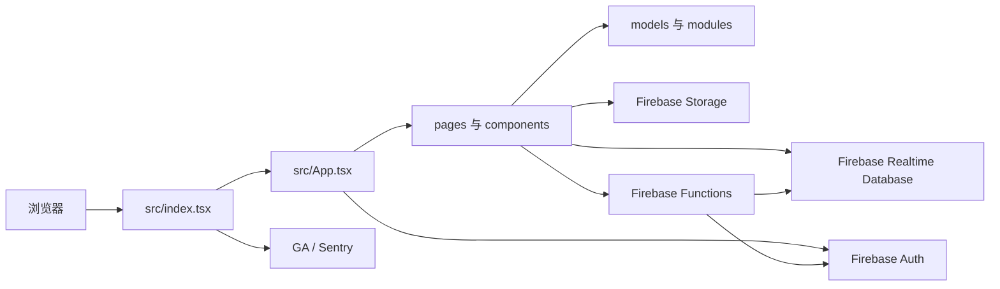

# Quorum 架构与组件说明

> 本文件是本仓库的维护入口。后续涉及代码、构建、测试或运行的工作，应先阅读本文件和 `AGENTS.md`，并以实际代码为准更新本文档。

## 1. 项目定位与技术栈

Quorum 是一个用于 Model UN（模拟联合国）委员会管理的单页 Web 应用。它基于开源项目 [Muncoordinated](https://github.com/MaxwellBo/Muncoordinated-2)，当前源码仓库为 [brepublic/Quorum](https://github.com/brepublic/Quorum)。委员会业务仍由浏览器直接访问 Firebase；账号管理等需要服务端权限的少量操作由 Firebase Cloud Functions 执行，不包含常驻的自建 API 服务。

| 层级 | 实现 | 责任 |
| --- | --- | --- |
| UI | React 18、Semantic UI React、flag-icons SVG、CSS | 页面、表单、响应式导航、计时器、提示、国旗与中英文界面 |
| 路由 | React Router v5 + `history` | 客户端路由及页面切换 |
| 状态/实时同步 | Firebase Realtime Database（兼容 API 为主） | 委员会及其所有业务数据的实时读取和写入 |
| 身份认证 | Firebase Authentication + Cloud Functions | 邮箱登录、管理员初始化、管理员创建/重置/删除账号及写入权限身份 |
| 文件 | Firebase Cloud Storage | 委员会附件上传、下载、删除 |
| 可观测性 | Google Analytics、Sentry | 页面访问与客户端错误/性能上报（仅非本地模拟器模式） |
| 构建/测试 | Vite、TypeScript、Vitest、Cypress、Firebase CLI | 开发服务器、生产构建、单元和端到端测试 |

## 2. 运行时总体结构



`src/index.tsx` 初始化 Google Analytics、Sentry、浏览器 history 与 Semantic UI 样式，并把 `App` 挂载到 `#root`。`src/App.tsx` 初始化 Firebase，并在显示普通路由前调用 Functions 检查管理员是否完成初始化；未初始化时所有路径都会进入首次管理员创建程序。若 `VITE_USE_FIREBASE_EMULATORS=true`，则连接本机 Auth（9099）、Realtime Database（9000）、Storage（9199）和 Functions（5001），否则连接 `muncoordinated` Firebase 项目。

`src/i18n.tsx` 提供无外部运行时依赖的界面国际化层。当前支持英语和简体中文；英语原文同时作为稳定词条键，简体中文词条集中维护。`LanguageProvider` 在语言变更时重新挂载界面，使类组件与函数组件统一获取新文案，并集中覆盖 Semantic UI 的搜索空结果、可新增选项等默认文案；语言切换控件嵌入主页、创建页和委员会工作区的导航菜单。用户选择保存在浏览器 `localStorage` 的 `muncoordinated-language` 项中，首次访问则根据浏览器语言选择默认值。除用户模板、国家模板和国家名称外，业务数据（委员会名称、帖子正文等）不会被翻译或写回；这些可本地化名称均在 Firebase 中保存默认语言和语言到名称的映射，并按当前界面语言解析。内置默认国家模板从静态国家列表生成，包含英语、简体中文名称、Emoji 国旗和大洲；标准 ISO 国家在界面中使用本地打包的 `flag-icons` 独立 SVG 渲染，以保证放大后的清晰度，自定义 Emoji 与上传图片仍按保存值显示。

`src/theme/` 提供纯前端外观主题系统。`ThemeProvider` 包裹整个应用，根据当前路由在 `#quorum-app` 写入稳定的页面/区域和受控外观属性，并为常见 Semantic UI 节点补充组件类型令牌；当前内置样式是不附加覆盖的默认主题。推荐的主题 API 2 是单个声明式 `.quorum-theme.json` 文件，只能设置经过白名单约束的语义颜色、排版、密度、形状、材质、动态预设、组件变体和页面内容宽度；导入器拒绝未知字段，并在安装前验证关键文字、语义按钮和焦点颜色的 WCAG 对比度。运行时由 Quorum 自己把这些设置映射为 CSS 变量和有限的 `data-theme-*` 属性，因此主题不能隐藏或重排业务控件。旧版 API 1 任意 CSS 主题继续通过 `@scope (#quorum-app)` 兼容，但在管理器中标记为旧版格式。导入、切换、删除与当前选择仅使用浏览器 `localStorage`，v2 存储会读取旧 v1 键完成迁移；导出由浏览器下载触发，不改变 Firebase、规则、路由或业务组件树。主题管理器位于作用域外作为恢复入口。完整契约见 `THEME_ADAPTER_GUIDE.md`。

简体中文排版由 `src/App.css` 中基于 `html[lang='zh-CN']` 的全局规则控制：统一中文字体回退、菜单/按钮/表头和术语列的防拆分规则，并通过 CSS 容器查询按栏宽调整表格密度；支持 `word-break: auto-phrase` 的浏览器会自动使用词组感知换行。新增页面通常无需为中文逐项添加排版补丁。

## 3. 路由与页面职责

| 路径 | 页面/组件 | 主要职责 |
| --- | --- | --- |
| `/` | `Homepage` | 产品主页与入口 |
| `/onboard`、`/committees` | `Onboard` | 登录后创建委员会 |
| `/templates` | `Templates` | 管理当前登录账号的自定义委员会模板及模板成员 |
| `/countries` | `Countries` | 管理账号级国家模板、国家多语言名称、Emoji/图片国旗和大洲 |
| `/admin` | `AccountAdmin` | 首次创建唯一管理员，以及管理员创建账号、重置密码和删除账号 |
| `/committees/:committeeID` | `Committee` | 订阅整个委员会数据、显示欢迎页及主导航 |
| `.../setup` | `Admin` | 委员会基础资料与成员设置 |
| `.../roll-call` | `RollCall` | 按代表团逐一记录出席状态、自动翻页并在点名完成后展示人数与议事门槛 |
| `.../motions` | `Motions` | 动议队列、表决及相关计时流程 |
| `.../unmod` | `Unmod` | 自由磋商计时器 |
| `.../caucuses/:caucusID` | `Caucus` | 主发言名单或有主持核心磋商、发言队列、发言记录与计时 |
| `.../resolutions/:resolutionID/:tab?` | `Resolution` | 决议文本、修正案、讨论流与投票 |
| `.../strawpolls/:strawpollID` | `Strawpoll` | 意向性投票选项与计票 |
| `.../notes` | `Notes` | 委员会笔记 |
| `.../posts` | `Files` | 链接、文本和 Storage 附件 |
| `.../stats` | `Stats` | 委员会统计 |
| `.../settings`、`.../help` | `Settings`、`Help` | 行为设置和使用帮助 |

`Committee` 是委员会工作区的壳层：它对 `/committees/:committeeID` 建立 Realtime Database `value` 订阅，把当前委员会对象交给导航和管理页；具体业务页通常各自建立对应订阅。

点名页把每个代表团的最终出席/缺席结果保存到成员现有的 `present` 字段，并用 `rollCall/called/{memberID}` 与 `rollCall/currentMemberID` 保存点名进度和当前代表团，因此刷新或重新进入页面后仍可继续。撤销历史和手动翻页位置仅属于当前页面会话状态。委员会设置页只展示总人数、有表决权人数与法定人数，依赖点名结果的出席人数和各类议事门槛会在点名完成后统一展示。

`present` 也是后续议事流程的统一出席来源：缺席代表团会保留在动议、决议表决和发言名单的选择界面中，但以缺席状态灰显且不能操作；已经排入发言队列后才变为缺席的代表团会被自动跳过。决议页的动态、文本、修正案和表决子页共用全宽响应式外框及统一的页边距，以保持标签菜单、决议名称和状态控件在子页间的位置稳定。决议表决页使用可分页的代表团矩阵，逐国记录赞成、反对或弃权，并同时展示简单多数、三分之二多数和实时票数；通常在已达到门槛或剩余票数已不可能达到门槛时自动显示结果，但委员会中存在一票否决席位时，必须等待所有出席且有表决权的代表团完成表决后才显示通过、未通过或被否决的结果。公开动议投票以 `memberID` 作为票键，不再使用浏览器匿名投票者 ID，数据库规则会校验投票代表团仍为出席状态。

主发言名单在导航中独立于有主持核心磋商，但继续复用 `caucuses/gsl` 的页面、队列和发言记录数据，只显示并驱动每位代表的发言计时器。代表发言倒计时归零只会停止该计时器，不会改变主发言名单的开放状态，主发言名单也不参与任何自动结束判定。发言开始后必须先暂停才能切换至下一位；原发言人可把大于一秒的剩余时间让渡给主席、其他代表、问题或评论，受让发言、回答和评论均继承原剩余时间且不得再次让渡。开始、暂停、继续、结束和让渡决定会按服务器时间写入 `caucuses/gsl/logs`，为后续正式日志界面保留持久化记录。其他有主持核心磋商的发言计时器和磋商计时器在代表发言期间同步启停；一名代表发言结束后，发言计时器按单位发言时长重置，磋商计时器保留剩余时间并暂停。所有计时器到零后会自动停止且不会进入负数。若剩余时间不足一次完整发言，磋商自动关闭并引导主任返回动议界面。

动议提出后会一直保留在动议列表中，直至仍处于待裁决状态时被删除。主任确认“通过”或“未通过”后，动议会保存 `result` 与 `decidedAt`；会创建或更新其他议事资源的动议还会保存 `destination`，供用户从已裁决动议跳转到对应页面。旧动议没有这些可选字段时仍按待裁决状态显示。

## 4. 数据模型与数据流

Realtime Database 的主根节点是：

```text
committees/{committeeID}
  creatorUid, name, chair, topic, conference
  template, templateKey, countryTemplateKey, temporaryTemplate
  members/{memberID}
  rollCall
    called/{memberID}: true
    currentMemberID
  caucuses/{caucusID}
    logs/{logID}: message, createdAt
  resolutions/{resolutionID}
  strawpolls/{strawpollID}
  motions/{motionID}
  files/{postID}
  timer, notes, settings

templates/{creatorUid}/{templateID}
  name
  defaultLanguage
  names/{languageCode}
  countryTemplateKey
  members/{memberID}
    name, rank, present, voting, flag?/{type,value}

countryTemplates/{creatorUid}/{countryTemplateID}
  name, defaultLanguage, names/{languageCode}
  countryLanguages/{index}
  countries/{countryID}
    name, defaultLanguage, names/{languageCode}
    continent
    flag/{type,value}

system
  adminUid
  bootstrapComplete
```

`src/models/committee.ts` 定义 `CommitteeData`、默认委员会和内置模板。`src/models/template.ts` 定义账号级自定义模板及其 Firebase 增删改辅助函数；模板成员复用委员会成员的四种 `Rank`、出席、必须投票字段，并可携带从国家模板取得的自定义国旗快照。`src/models/country-template.ts` 定义内置及账号级国家模板；上传的图片国旗在浏览器端等比缩放到最大 256×160 并转为 WebP data URL，随国家记录保存到 Realtime Database，不使用 Storage。把模板成员加入委员会时会继续保存国旗快照；对已有同名成员重新应用模板也会更新其自定义国旗。其余 `src/models/*.ts` 文件定义对应子资源（成员、动议、磋商、决议、调查、帖子、计时器和设置）及创建/更新辅助函数。页面通过 Firebase 引用的 `on('value')` 接收实时快照；`src/modules/handlers.ts` 将输入控件事件映射为字段级 Database 写入。计时相关更新使用 Realtime Database transaction，以减少并发更新冲突。

每个委员会模板通过 `countryTemplateKey` 固定引用一个国家模板；多个委员会模板可以引用同一个国家模板，旧委员会模板缺少该字段时按 `builtin:default` 读取。模板编辑器允许更改这项引用，国家管理器删除自定义国家模板前会按该字段查询当前账号的委员会模板，若仍有引用则拒绝删除并列出占用模板；`database.rules.json` 为这项检查配置了索引。创建委员会时会把委员会模板及其国家模板引用一并快照到委员会；未选择现有委员会模板时，创建页必须要求选择国家模板，并以 `temporaryTemplate: true` 标记为手工设置的临时委员会模板。设置页随后按委员会保存的国家模板加载可选国家及国旗；从现有委员会模板追加成员时会同时把委员会切换到该模板及其国家模板引用。

浏览器本地还会通过 `src/hooks.ts` 的 `useLocalStorage` 保存匿名投票者 ID；意向性投票使用它识别同一浏览器。动议投票则使用所选代表团的 `memberID`，以便将票与持久化的出席状态关联。

## 5. 身份、权限与文件

- `src/components/auth.tsx` 只提供 Firebase 邮箱密码登录，不提供网页端自行注册或找回密码入口，并查询 `creatorUid` 等于当前用户 UID 的委员会以显示“我的委员会”。管理员登录后还会显示账号管理入口。
- 首次部署时，`App` 强制显示管理员创建程序。新账号登录后调用 `bootstrapAdmin`；该函数通过 `system/adminUid` 的 Realtime Database 事务确保只能有一个初始化胜者，随后为该 UID 写入 `admin: true` 与 `managed: true` 自定义声明并标记 `system/bootstrapComplete`。客户端无法写入这两个系统字段。
- `functions/src/index.ts` 使用 Firebase Admin SDK 实现账号列表、创建、密码重置和删除。每个管理函数都同时校验调用者 ID token 中的 `admin` 声明与服务端保存的 `system/adminUid`；通过后台创建的普通账号带有 `managed: true` 声明。委员会、账号级模板与国家模板的 Database Rules 也要求该声明，因此绕过网页直接调用 Firebase Auth 注册接口得到的身份无法使用主任写入功能。管理员账号不能删除自身。账号删除仅删除 Authentication 身份，不级联删除委员会、模板或附件。
- 登录后的“我的委员会”列表与委员会右上角账户弹窗共用同一账户组件；主任确认删除委员会后，客户端会先递归删除 `Storage/committees/{committeeID}` 下的附件，再删除 Realtime Database 的整个 `committees/{committeeID}` 节点。账号级 `templates` 与 `countryTemplates` 位于独立根节点，不参与委员会删除。
- `database.rules.json` 允许读取委员会；常规写入要求登录用户带有 `managed: true` 声明且是该委员会创建者。对公开队列、公开修正案、公开调查选项/投票和公开动议存在细粒度例外。公开发言排队、动议提出与动议投票会校验对应 `memberID` 的 `present` 状态，并校验公开提交的代表团名称与成员记录一致。
- `templates/{creatorUid}` 仅允许 UID 对应的受管登录用户读写，自定义模板不会向其他账号或未登录访问者公开。
- `countryTemplates/{creatorUid}` 同样仅允许 UID 对应的受管登录用户读写；内置默认国家模板随前端代码发布，不写入 Firebase。
- `storage.rules` 允许公开读取 `committees/{committeeId}/{fileName}`；上传需写入委员会创建者 UID 元数据。文件拥有者或委员会主任可更新/删除。
- `Files.tsx` 同时维护 Database 中的文件/帖子元数据和 Storage 中的二进制对象。

因此，数据库规则和 Storage 元数据是产品的关键安全边界；变更前必须同时审查前端写入路径与这两份规则文件。

## 6. 工程目录与部署

| 位置 | 内容 |
| --- | --- |
| `src/pages/` | 路由级业务页面 |
| `src/components/` | 可复用 UI、认证、计时器、通知、连接状态 |
| `src/models/` | 数据类型、默认值和 Firebase 数据操作 |
| `src/services/account-admin.ts` | 管理员 Callable Functions 的浏览器端类型与调用封装 |
| `src/theme/` | 本地主题包校验、路由/组件适配钩子、主题切换与导入导出界面 |
| `functions/` | Firebase Functions 管理端账号接口及独立 TypeScript 构建 |
| `src/modules/` | 通用事件处理、成员转换、统计和埋点 |
| `src/i18n.tsx` | 英语/简体中文词条、语言偏好与全局语言切换控件 |
| `cypress/` | 端到端用例、模拟器种子和支持代码 |
| `scripts/` | Firebase Emulator 与 Cypress 编排、规则部署 |
| `database.rules.json`、`storage.rules` | Firebase 权限规则 |
| `firebase.json` | 本地模拟器端口与 Firebase Hosting 配置 |
| `netlify.toml` | Netlify 构建命令（`pnpm build`）与 `build/` 发布目录 |

生产构建输出为 `build/`。`firebase.json` 同时定义 SPA 回退重写；当前 `netlify.toml` 指定 Netlify 使用 Node 22。

## 7. 本地开发、验证与限制

先安装依赖：

```sh
pnpm install --frozen-lockfile
```

本仓库的 WSL 本地工具链位于被忽略的 `.tools/`。先执行下面命令，便可使用该目录中的 Node 22、pnpm 10 与 Java 21；它还会把错误继承的 Windows 临时目录改为 `/tmp`：

```sh
source scripts/wsl-env.sh
```

常用命令：

```sh
pnpm start                         # Vite 开发服务器（localhost:5173）
pnpm exec vitest run               # 一次性单元测试；pnpm test 是 watch 模式
pnpm build                         # TypeScript 检查并生产构建
pnpm emulators                     # Firebase Auth/RTDB/Storage/Functions 模拟器
VITE_USE_FIREBASE_EMULATORS=true pnpm start
pnpm test:e2e                      # 模拟器 + Vite + Cypress 集成测试
```

Firebase Emulator Suite 需要 Java 21 或更高版本。端到端测试只能连接本地模拟器，不能指向生产 Firebase 项目。Cypress 二进制若未预下载，可能因网络限制无法下载；此时至少运行 TypeScript 构建和 Vitest，并如实记录 E2E 未执行原因。

## 8. 维护注意事项

1. 这是 React Router v5、Firebase compat API 与少量 Firebase modular API 并存的代码库；修改 Firebase 初始化或引用类型时要兼容两种用法。
2. 生产默认会连接真实 Firebase。任何本地手工测试应显式设置 `VITE_USE_FIREBASE_EMULATORS=true`。
3. 不要把 Firebase 配置中公开的 Web 配置误判为服务端密钥；真正的访问控制由 Firebase Rules 和用户身份决定。
4. 新增委员会字段或公开协作功能时，同步更新 TypeScript 模型、默认值、前端写入路径、规则和测试。
5. 首次生产部署必须同时部署 Functions 与 Database Rules，再发布前端；否则前端无法检查或完成管理员初始化。管理员功能可用 `pnpm deploy:functions` 部署。
