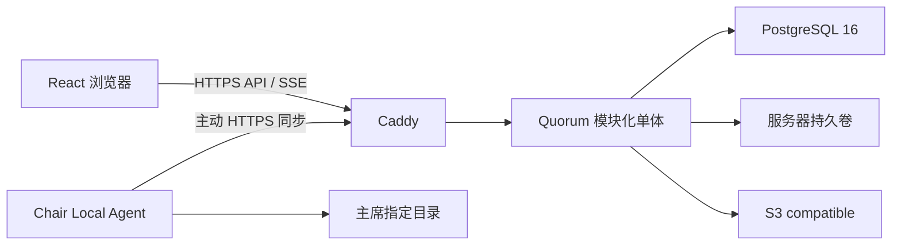

# Quorum 架构与组件说明

> 本文件是本仓库的维护入口。涉及代码、构建、测试、运行依赖、安全边界或部署模型的工作，应先阅读本文件和 `AGENTS.md`，并以实际代码为准同步更新。

Quorum 已完成自主托管实施计划阶段 0–9。当前只有一条生产运行路径：React 浏览器通过同源 HTTP API 与 SSE 访问 Node.js 模块化单体，PostgreSQL 16 保存账号、权限、议事、文件元数据、事件和审计。文件字节由服务器持久卷、S3 compatible provider 或当前 Chair Local Agent 承载。旧 BaaS 运行代码、Functions、Rules、emulator、SDK、CLI 和对应浏览器测试资产已删除；当前仓库不提供旧数据导入或双写。

## 1. 技术栈与拓扑

| 层级 | 实现 | 责任 |
| --- | --- | --- |
| 浏览器 | React 18、TypeScript、React Router v5、Semantic UI React | 身份、委员会、模板、议事、文件和运维页面 |
| 同源边界 | Caddy | HTTPS、SPA fallback、API/SSE 反向代理、安全响应头 |
| 应用 | Node.js 22 TypeScript 模块化单体 | 身份、授权、业务命令、文件编排、worker、健康与指标 |
| 业务真相 | PostgreSQL 16 | 状态、revision、幂等结果、事件、审计、任务与文件元数据 |
| 文件 provider | SERVER_VOLUME、S3_COMPATIBLE、CHAIR_AGENT | 经大小/SHA-256 校验的不可变内容字节 |
| 可观测性 | 结构化 stdout、Prometheus `/metrics`、Sentry、Google Analytics | 服务运行证据、聚合指标和浏览器错误/访问上报 |
| 构建与测试 | pnpm、Vite、Vitest、PostgreSQL integration、Docker Compose | 类型检查、生产构建、契约/服务/HTTP/数据库验证 |



生产 Compose 只暴露 Caddy 的 80/443；PostgreSQL 没有主机端口映射。应用和数据库使用持久卷，浏览器不直接连接数据库、对象存储或 Chair Agent。

## 2. 浏览器应用

`src/index.tsx` 初始化浏览器 history、语言、主题、Semantic UI、Sentry 与 Google Analytics，再挂载 `src/App.tsx`。`App` 无运行模式分支，始终进入 `SelfHostedIdentity`。浏览器身份使用 Secure、HttpOnly、SameSite=Lax Session Cookie；客户端只通过 `src/services/self-hosted-identity.ts` 和 `self-hosted-api.ts` 请求同源 `/api/v1`。

`SelfHostedIdentity` 覆盖首次管理员初始化、登录、临时密码强制修改、退出和系统管理员账号管理。`SelfHostedWorkspace` 提供：

- `/committees`：公开/私有委员会列表与创建；
- `/countries`、`/templates`：账号级国家模板和委员会模板；
- `/committees/:id`：委员会概览、成员/席位、规则、点名、问题、文本、计时器、发言名单、动议、表决、意向性投票、决议、文件、归档与删除；
- `/storage`：仅系统管理员使用的 S3 配置；
- `/operations`：仅系统管理员使用的容量、队列与 retention 聚合状态；
- `/admin`：账号创建、重置、禁用、Session 撤销和不可逆匿名化。

委员会工作区先获取受众过滤快照，再为一个委员会保持最多一条 SSE。客户端检测事件序号缺口、未知事件或过期游标时丢弃增量并重新取完整快照，不从本地猜测权威状态。陈旧 revision、幂等冲突和规则冲突均要求显式刷新或裁决，不静默覆盖。

`src/i18n.tsx` 提供英语与简体中文界面，使用大陆模拟联合国术语。语言选择继续保存在兼容键 `muncoordinated-language`。`src/theme/` 的 Theme API 2 只接受白名单声明式设置；旧 API 1 主题和既有 localStorage 键继续作为显式兼容边界。主题不能隐藏、重排或改写业务控件和数据。

## 3. 服务端模块与数据边界

`server/` 是单进程模块化单体。启动时使用 PostgreSQL advisory lock 执行带 SHA-256 校验和的顺序 migration；当前 schema compatibility 为 26。数据库版本、连接、存储目录可写性或容量采样不满足要求时 readiness 失败。

| 模块 | 责任 |
| --- | --- |
| Identity | bootstrap、Argon2id 密码、Session、账号生命周期和身份审计 |
| Stage 3/4 | 委员会、席位、模板、规则包、点名、问题和文本资源 |
| Stage 5 | SSE、权威计时器、发言/让渡、动议、ballot、Strawpoll、决议与修正案 |
| Storage | durable staging、provider、文件版本、审核发布、下载、删除和迁移 |
| Storage Agent | 配对、lease fencing、manifest/task、内容传输、本地变化与冲突 |
| Operations | 归档导出、委员会删除、账号处置、retention、状态、健康和指标 |

`packages/contracts/` 保存浏览器、后端与 Agent 共用的错误码、事件、审计动作、响应类型和不可变规则快照。`packages/rule-schema/` 保存规则包 v1 的 schema、安全表达式求值和内置 `Quorum Default`/北京学术标准 fixture。`packages/storage-agent/` 保存独立 Chair Agent 客户端、安全目录、扫描、恢复循环和发布入口。

所有业务写入使用表达意图的命令。服务端从 Session 或独立 Agent 凭据推导 actor，在一个 PostgreSQL 事务中完成授权、行锁/revision 检查、状态变化、事件、审计和 durable 幂等结果。系统管理员、Committee Owner、Chair 与代表席位是独立能力；系统管理员和 Owner 不自动获得 Chair 学术权限。

公开委员会只向匿名读者返回公开字段和已发布文件。私有委员会对未授权身份统一隐藏。正式 ballot 冻结席位资格、must-vote、门槛、否决席位和规则版本；一席一票由数据库唯一约束保证，更正票追加历史。匿名意向性投票分离回执与选项，不保存投票人与选项关联。

## 4. 实时、并发与审计

PostgreSQL 委员会事件表提供严格递增序号，SSE 只是传输通道。一个命令提交后，快照、事件和审计来自同一业务事务。数据库通知只唤醒进程，不承载唯一事件副本。

- 普通资源使用整数 revision 和 `409 Conflict`；
- 可重试创建与破坏性命令使用 `Idempotency-Key`；
- 计时器保存服务器时间基准，不每秒写数据库；
- 发言队列通过行锁和唯一活动位置串行化；
- Chairman override 显式记录原版本、操作者与原因；
- 业务审计和委员会事件追加写，只有受 fenced 委员会永久删除事务才能清除所属历史。

## 5. 文件与 Chair Agent

PostgreSQL 是文件 entry、不可变 version、大小、SHA-256、provider binding、同步状态和删除墓碑的唯一业务真相。浏览器上传直接流入 durable staging，不先读取完整文件到内存；用户文件名不参与内部磁盘或对象 key。完整字节经服务器重算大小与 SHA-256 后才能提交版本。

SERVER_VOLUME 使用 0600 临时文件、fsync 和无覆盖原子发布。S3 endpoint 只接受经过 SSRF 校验的 HTTPS 目标，凭据使用实例 master key 与带版本 AAD 的 AES-256-GCM 密文；响应、事件和日志不回显凭据。下载在发送 200 前重新验证 provider 字节，并始终使用安全 attachment、nosniff 与同源隔离头；危险可执行类型强制为 `application/octet-stream`。

逻辑删除立即隐藏文件并写不可恢复墓碑，再由 durable job 幂等清理每个物理副本。provider migration 复制全部历史 blob 并复验后才原子切换 binding；失败时旧 provider 继续服务。maintenance worker 只清理明确终态且可删除的 staging，唯一暂存副本、待重试 copy 和退休源副本不因期限、LRU 或容量压力删除。

Chair Agent 使用独立 `QuorumAgent` authorization scheme。一次性配对码和设备凭据只保存哈希；一个委员会最多一个活动 host。单调 lease generation fence 使转移或撤销后的旧设备不能 heartbeat、claim、上传或完成任务。Agent 对本地路径做规范化并拒绝链接、硬链接、非普通文件和目录逃逸；服务端下发内容先完整校验再原子替换。本地并发编辑、墓碑冲突和主机转移不会静默覆盖，均形成 durable 冲突供 Chair 显式裁决。

## 6. 归档、删除与运维

Owner 可把活动委员会归档。归档后全部业务写命令在服务端拒绝，既有角色仍按授权读取和下载。Owner 导出在 `REPEATABLE READ READ ONLY` 快照中流式输出 JSON Lines，包含议事、审计与文件 manifest，不含凭据、provider key、源 IP 摘要或文件正文。

永久删除只允许归档委员会 Owner 在当前 revision 上精确确认名称。接受后委员会进入 `DELETING` 并立即退出普通读取/写入；durable worker 等待服务器卷、S3、Chair Agent 和全部 staging 清理，再以当前 claim token 限定的单个事务清除委员会业务数据。任一屏障或 SQL 失败都保留可重试追踪状态。

禁用普通账号可由系统管理员在把委员会、账号级模板与规则包原子转移给活动接收方后不可逆匿名化。历史 actor ID 保留，但邮箱、显示名、凭据和 Session 被清除，数据库触发器禁止恢复个人身份。

retention worker 使用 advisory lock，仅清理明确过期且不再承载业务真相的 Session、幂等结果、终态一次性秘密和已决定注册申请。事件、审计、Agent task、provider/delete job、deletion job 与墓碑不参与普通期限清理。系统管理员状态页只返回固定聚合字段，不返回标识、文件路径、provider key 或凭据。

`pnpm self-host:backup -- <new-directory>` 输出 PostgreSQL custom dump、文件 provider manifest 和 SHA-256 元数据。数据库与 provider 字节不是跨介质原子快照；恢复必须按 `docs/self-hosted/RECOVERY.md` 在隔离环境逐对象核对。首版不调度自动备份，也不提供自动破坏性 restore。

## 7. 部署与仓库结构

| 路径 | 内容 |
| --- | --- |
| `src/` | 单一自托管 React 入口、身份/工作区页面、同源 API client、主题与 i18n |
| `server/` | Node.js 模块化单体、HTTP、领域服务、worker、migration 与集成测试 |
| `packages/contracts/` | 浏览器/后端/Agent 共用契约 |
| `packages/rule-schema/` | 规则包 schema、求值器与 fixture |
| `packages/storage-agent/` | Chair Agent 客户端与文件系统核心 |
| `deploy/` | Caddy、应用与 PostgreSQL Compose、Dockerfile 和环境模板 |
| `docs/self-hosted/` | 目标规格、实施历史、恢复与人工验收 |

`deploy/compose.yaml` 为当前生产拓扑。Caddy 代理 `/api/v1/*`、`/health/*` 和 `/metrics`，其余路径回退 SPA。容量默认 80% warning、90% critical；critical 只拒绝新文件字节和 provider copy，下载、议事与清理继续可用。Compose 的 JSON 日志固定轮换为 10 MiB × 3。

## 8. 开发与验证

所有项目命令前先运行：

```sh
source scripts/wsl-env.sh
```

常用命令：

```sh
pnpm start                         # 自托管浏览器开发服务器
pnpm exec vitest run               # 全仓单元、契约与 HTTP 测试
pnpm test:self-host                # 自托管有限测试集
pnpm test:self-host:integration    # 真实 PostgreSQL 临时数据库测试
pnpm build:self-host               # 浏览器、契约、规则、后端与 Agent 构建
pnpm verify:no-legacy-runtime      # 检查生产源码、依赖、配置与构建产物
pnpm self-host:test-db:up          # 启动本地 PostgreSQL 16 测试服务
pnpm self-host:test-db:down
```

集成测试必须使用 `TEST_DATABASE_ADMIN_URL` 创建随机临时数据库；未配置时明确 skip，不使用内存数据库替代。GitHub Actions 提供 PostgreSQL 16 service 并执行自托管测试、真实 integration 与生产构建。

当前 WSL 已完成类型、Vitest、构建、锁文件和静态零运行依赖验证。真实 PostgreSQL/Compose、Caddy TLS、多浏览器、真实 S3/持久卷、Chair 原生平台、签名公证、备份恢复和生产网络 HAR 仍按 `docs/self-hosted/MANUAL_ACCEPTANCE.md` 逐项取证；自动测试或 mock 不能替代这些证据。
