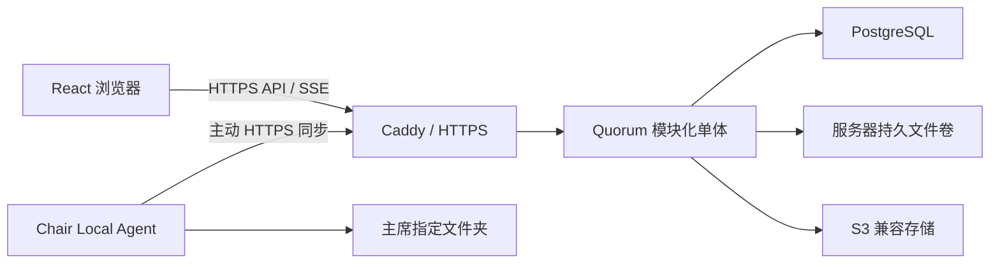

# 自托管系统架构规格

## 1. 目标与非目标

目标是让一个 Quorum 实例在不依赖 Firebase 或其他 BaaS 的情况下独立完成账号、委员会、议事、实时协作和文件管理，并保留现有 React UI 可以逐步迁移的边界。

首版非目标：

- 不迁移现有 Firebase 账号、委员会、模板或附件。
- 不支持多区域、多主数据库或无限水平扩容。
- 不提供代表端离线写入或冲突后自动合并。
- 不允许规则包执行任意 JavaScript、SQL 或操作系统命令。
- 不提供自动备份服务；但保持 PostgreSQL 和文件卷可由标准工具备份。

## 2. 运行拓扑



首版生产容器建议为 Caddy、Quorum 应用和 PostgreSQL。后台任务由应用内 worker 模块执行，待实际负载需要时再拆成独立进程。

## 3. 后端模块

| 模块 | 责任 |
| --- | --- |
| Identity | 首次管理员初始化、登录、Session、临时密码、账号禁用与匿名化 |
| Authorization | 系统、委员会归属、主席、代表席位和匿名能力判断 |
| Committees | 委员会、成员关系、席位、邀请、公开性与归档 |
| Rules | 规则包解析、默认值、提示、表达式、版本和主席裁决 |
| Proceedings | 点名、问题、发言名单、磋商、动议、文件和议事阶段 |
| Voting | 正式表决、修正案表决、动议票、匿名或席位 Strawpoll |
| Timers | 服务器权威时间、开始/暂停/延长/过期与计时器快照 |
| Realtime | 快照、outbox 事件、SSE 游标补偿和重新同步 |
| Storage | 上传暂存、文件版本元数据、服务器卷、S3 与 Agent 适配器 |
| Audit | 不可变关键操作记录、主席代办和系统管理员介入 |
| Operations | 健康检查、migration、日志轮换、磁盘阈值和后台任务 |

模块可以共用一个部署进程，但只能通过服务接口和数据库事务协作，不允许页面处理器任意跨表写入。

## 4. 身份与 Session

### 4.1 首次初始化

首次启动生成一次性 bootstrap secret，并只通过服务器控制台或部署日志交给实例所有者。创建管理员时在 PostgreSQL 事务中确认系统尚未初始化、验证 secret、创建唯一初始系统管理员并销毁 secret。公开网络上的第一个访客不能仅凭“尚未初始化”取得管理员身份。

### 4.2 账号策略

首版 `registration_policy = ADMIN_ONLY`。系统管理员创建账号并分配一次性临时密码；首次成功登录后必须修改密码。未来增加 `SELF_REGISTRATION_WITH_APPROVAL` 时复用注册申请和审批状态，不改变现有账号身份。

密码使用 Argon2id。浏览器只保存随机 Session Cookie：`Secure`、`HttpOnly`、`SameSite=Lax`，写请求同时执行 CSRF token 和 Origin 校验。数据库只保存 Session token 哈希。登录、提权和密码修改后轮换 Session ID；账号禁用、密码重置和用户级撤销会使现有 Session 失效。

## 5. 权限模型

权限不是一条简单的角色高低链，而是独立能力：

| 身份或能力 | 范围 |
| --- | --- |
| `SYSTEM_ADMIN` | 实例、账号、共享规则包和存储配置 |
| `COMMITTEE_OWNER` | 委员会归属、任命 Chair、归档和删除 |
| `CHAIR` | 最高议事控制、主席代办、裁决和规则覆盖 |
| `DELEGATE` | 绑定席位的代表动作 |
| `ANONYMOUS` | 公开只读和获得授权的匿名 Strawpoll |

系统管理员如需介入委员会议事，必须显式进入紧急维护模式，获得短期委员会能力，并记录介入原因。系统管理员不会天然获得学术裁决权。

### 5.1 主席代办

每个可能归属于席位的命令同时记录：

```text
actor_user_id         实际操作账号
on_behalf_of_seat_id  议事行为归属席位
```

代表本人提交时两者根据 Session 和席位绑定推导；主席代办时由主席选择席位。客户端不能可信地提交代表名称冒充席位。页面可显示“中国提出”，审计必须能显示“主席代中国录入”。

## 6. 委员会运作模式

`DELEGATE_OPERATED`：代表在自己的设备上提交问题、动议、发言申请和选票，主席负责批准、裁决和维持秩序。

`CHAIR_OPERATED`：代表端议事操作只读，代表在现场表达行为，由主席选择相应席位代为录入。两种模式使用相同业务命令和状态模型，只改变谁可以直接发起命令。

模式可由主席切换；切换只影响后续授权，不删除待处理请求或历史操作，并产生实时事件和审计记录。

## 7. 规则与主席裁决

有效规则按以下顺序解析：

```text
本次主席裁决
  > 委员会当前规则版本
  > 所选规则包版本
  > Quorum 产品默认值
```

规则评估只产生 `PASS`、`ADVISORY`、`WARNING` 或 `CHAIR_DECISION_REQUIRED`。主席可以对学术规则选择仅本次覆盖、创建新委员会规则版本，或者把新版本显式应用到当前流程。具体契约见 [`RULE_PACKAGE_SPEC.md`](./RULE_PACKAGE_SPEC.md)。

## 8. 并发与事务

### 8.1 普通资源

普通设置和文本资源带整数 `revision`。客户端提交 `baseRevision`；同一资源已变化时返回 `409 Conflict`。不同资源可以独立并发。主席可以在读取当前值后执行显式强制覆盖，服务端保存被覆盖版本和审计记录。

不使用“高权限请求自动覆盖较低权限较新请求”。

### 8.2 专用并发规则

- 发言队列命令锁定相应 `speaker_list` 行并重新计算序号。
- 正式票以 ballot 与 seat 的唯一关系保证一席一票；更正票创建历史，不静默覆盖。
- 创建类和可重试命令接受 `Idempotency-Key`。
- 计时器保存 `running`、`started_at`、`remaining_at_start_ms` 和 `revision`，不每秒写数据库。
- 一个业务命令在同一事务内完成状态、outbox 事件和审计记录。

## 9. 实时同步

客户端进入委员会时获取完整快照和该委员会最后事件序号：

```json
{
  "data": {},
  "sync": {
    "committeeEventSequence": 9182
  }
}
```

随后建立一条委员会级 SSE：

```text
GET /api/v1/committees/:committeeId/events?after=9182
```

事件表是持久游标来源；数据库通知只唤醒进程。客户端检测事件序号缺口时停止写入并补事件；游标超过保留期时重新取完整快照。

客户端连接状态：

| 状态 | 行为 |
| --- | --- |
| `LIVE` | 快照和 SSE 已对齐，正常写入 |
| `DEGRADED` | SSE 断开但 API 可达，高并发操作暂时禁用 |
| `OFFLINE_READONLY` | API 不可达，只读显示最后状态 |
| `RESYNCING` | 正在补事件或重新获取快照，禁止业务写入 |

SSE 断开不等价于 API 离线；客户端分别探测两条通路。

## 10. 文件与存储

每个委员会选择 `SERVER_VOLUME`、`CHAIR_AGENT` 或 `S3_COMPATIBLE`。三种提供者共用文件元数据、上传暂存、内容哈希和删除墓碑。

Chair Agent 下线只切换为 `STORAGE_DEGRADED` 并显示警告，不自动暂停会议。议事命令继续可用；暂存在服务器的上传等待 Agent 恢复同步。详细协议见 [`STORAGE_AGENT_SPEC.md`](./STORAGE_AGENT_SPEC.md)。

委员会永久删除是分阶段状态机，不是同步级联删除。Owner 先把委员会归档并精确确认名称；接受后状态进入 `DELETING`，所有普通读取和写入停止，但 durable deletion job、文件墓碑、provider delete job、Agent task 和 staging 记录继续存在。只有服务器卷、S3、当前 Agent 与三类 staging 的清理全部完成后，worker 才以当前 job claim 限定的事务清除 PostgreSQL 委员会数据。物理清理或数据库清除失败均退避重试，不能先丢失追踪元数据。

账号匿名化先禁用，再在一个 PostgreSQL 事务内把委员会、账号级模板和规则包转给指定活动账号。委员会转移递增 revision，并追加 Chair 事件与系统管理员审计；历史 actor、席位和审计外键不改写。资源全部转移后才删除凭据与 Session、清除邮箱和个人显示名。`DELETING` 委员会、无效接收账号、错误确认邮箱或幂等冲突会使整个事务回滚。

保留 worker 只删除有明确期限且不再授权或承载业务真相的记录：过期/撤销 Session、到期幂等结果、终态一次性邀请/配对秘密和已决定注册申请。advisory transaction lock 限制多实例并发 sweep；一次 sweep 全部提交或回滚，并写不含用户内容的追加式结果。委员会事件、业务/身份审计、Agent task 和删除追踪记录默认保留到所属委员会按永久删除流程清除。

## 11. 部署与容量

目标基线：Ubuntu Server x86-64、2 核、2 GiB 内存、40 GiB SSD、约 200 个账号、一个活动委员会、100 个席位、150 个并发浏览器、单文件 20 MiB、每委员会约 100 个文件。

- Caddy 只开放 80/443；PostgreSQL 不暴露公网端口。
- 一个浏览器对一个委员会最多一条 SSE。
- 应用限制内存和上传大小，日志必须轮换。
- 磁盘达到 80% 产生告警，90% 拒绝新的文件内容上传但不影响议事数据。
- 健康检查区分存活、数据库就绪、migration 版本和存储可写性。
- 数据库和文件使用持久卷；即使首版不配置备份，也不能写入容器临时层。
- 前端构建在镜像构建阶段完成，生产机只运行构建产物。

后续局域网模式沿用相同镜像，通过部署配置解决本地域名、TLS 信任和无公网运行。
